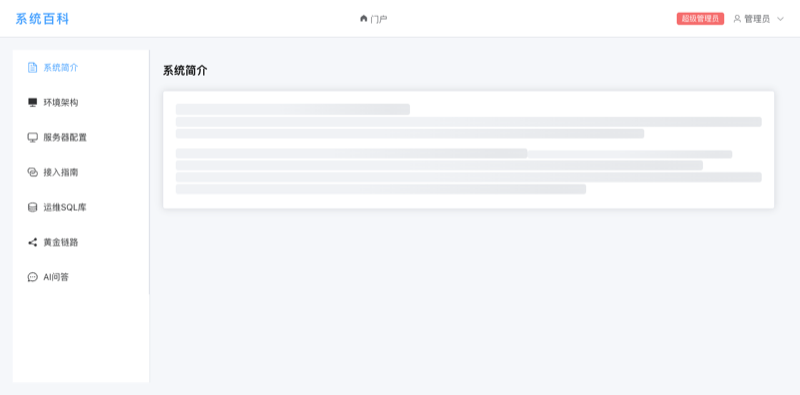
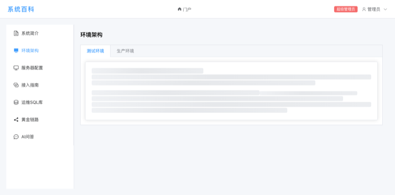
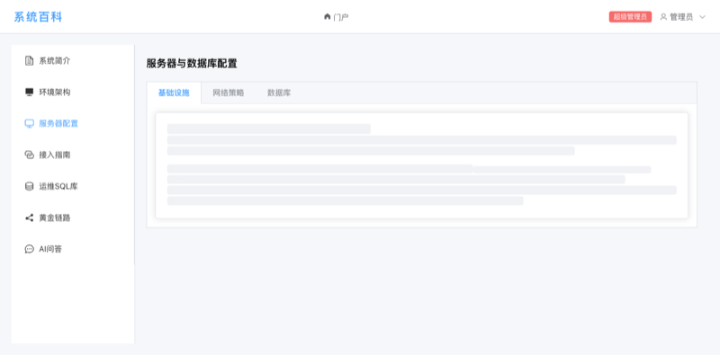
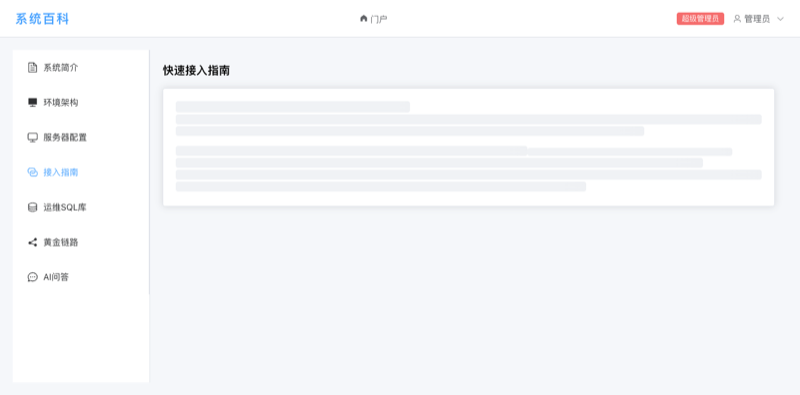

# 骨架屏截图

骨架屏（`el-skeleton`）在 API 加载数据期间显示，替代旧版旋转加载图标，提升用户感知性能。

| 页面 | 截图 | 结构说明 |
|------|------|----------|
| IntroPage |  | 单 `el-card`，8 条骨架（1 h3 + 6 p + 1 text） |
| ArchPage |  | 双 Tab（测试/生产），各含 8 条骨架 |
| ServerPage |  | 三 Tab（基础设施/网络策略/数据库），各含 8 条骨架 |
| GuidePage |  | 单 `el-card`，8 条骨架（1 h3 + 6 p + 1 text） |

## 骨架条宽度分布（每容器 8 条）

```
h3    40%       — 标题
p    100%      — 段落
p     80%      — 段落
p     60%      — 段落
text  35%      — 间隔/小元素
p     90%      — 段落
p    100%      — 段落
p     70%      — 段落
```

## 注意事项

- 截图尺寸 800×396（等比缩小至 800px 宽），适用于文档内嵌展示
- 截图在无后端环境下通过强制 `loading=true` 获取，实际运行时骨架屏会在 API 请求期间自动显示
- `MIN_LOADING_MS = 300` 保证骨架屏至少展示 300ms，防止极快响应时闪烁
